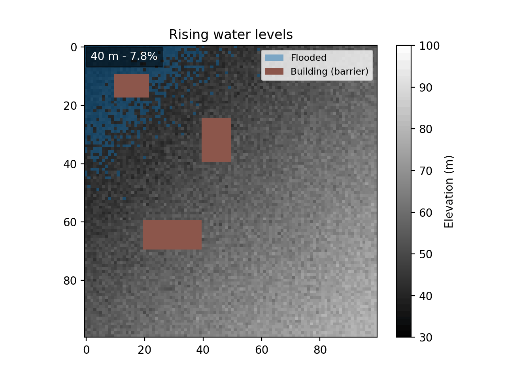

# Flood Inundation Analysis

> Experiment 4 of the [Smart Water Lab coursework](../README.md). The top-level README compares all four experiments and marks what the brief required versus the extra work I added.



A Python tool that maps flood inundation over a Digital Elevation Model (DEM): which cells go underwater at a given water level, how deep, and what fraction of the terrain floods. It lives in one file, `flood_inundation.py`, built on NumPy and Matplotlib. Run it as a script to generate the DEM and the deliverable figures, or import its functions for reuse.

---

## What it does

- Generates a synthetic 100×100 DEM (elevation 30–80 m) as a diagonal slope with mild Gaussian noise, or loads a real DEM from an Esri ASCII Grid (`.asc`) or NumPy (`.npy`) file. It burns rectangular building footprints in as 100 m barriers that never flood (446 cells across three rectangles in the shipped DEM).
- Floods the terrain two ways: a bathtub model (`simulate_flood`) that wets every cell below the water level, and connected-component routing (`flood_routing`) that spreads from a source cell through 4-connected neighbours, so isolated low pockets and ground behind buildings stay dry.
- Reports the flood at any level: the boolean mask, the per-cell inundation depth (`water_level - elevation`), the flooded-area percentage, and the flood volume (`sum(depth) * cell_area`).
- Sweeps the water level (40→50 m by default), confirms the flooded area rises monotonically, and renders the sweep as an animated GIF of rising water with an elevation bar and a building legend.
- Draws five Matplotlib figures (the grayscale DEM, the blue flood overlay, the depth heatmap, a side-by-side comparison across levels, and the flooded-area curve) and saves `flood_extent_40m.png`, `flood_extent_50m.png`, and `flood_curve.png`.

---

## The method

A DEM is a 2D grid of elevations. At a flood water level, the model applies the standard inundation logic cell by cell:

```
flooded(cell) =  elevation < water_level
depth(cell)   =  water_level - elevation     if flooded, else 0
flooded %     =  flooded_cells / total_cells * 100
volume        =  sum(depth) * cell_area       m³ when depth is in metres
```

The shipped synthetic DEM uses these parameters:

| Quantity | Value |
|---|---|
| Grid | 100 × 100 (10,000 cells) |
| Elevation range | 30–80 m, diagonal slope + Gaussian noise |
| Building barriers | 100 m, 446 cells across three rectangles |
| Deliverable water levels | 40 m and 50 m |
| Flood-curve sweep | 30–80 m |

The 30–80 m figure is the bare terrain range. The committed `dem_data.npy` reaches ~100 m, because the building footprints are burned in as 100 m barriers (446 cells) that never flood.

Real DEMs come from sources such as USGS SRTM (30 m resolution) and ALOS PALSAR (12.5 m). Export one to Esri ASCII Grid (`.asc`) and `load_real_dem` reads it with NumPy alone, keeping the header metadata and mapping NODATA cells to NaN.

---

## Requirements

- **Python 3.10 or newer.**
- **NumPy, Matplotlib, and Pillow.** NumPy and Matplotlib are needed even to import the module, since it pulls in Matplotlib at the top. Matplotlib's `PillowWriter` produces the GIF, so `Pillow` is needed for the animation (and by the tests).

| Package | Used by | Notes |
|---|---|---|
| `numpy` | model + plots | the DEM grid, masks, depth arrays |
| `matplotlib` | plots + GIF | the five figures and the animated GIF (via its `PillowWriter`) |
| `Pillow` | GIF | backs Matplotlib's `PillowWriter` to encode `flood_animation.gif`; also used by the tests |

Install the dependencies:

```bash
pip install -r requirements.txt
```

---

## Usage

### Running the analysis

```bash
python flood_inundation.py
```

This generates the seeded synthetic DEM with its three building barriers, saves it to `dem_data.npy`, writes the three deliverable PNGs, prints the 40→50 m dynamic sweep with a monotonicity verdict, and writes `flood_animation.gif`.

The script writes its figures with `savefig` and never opens a window, so it runs without a display. If Matplotlib still picks an interactive backend, force the headless one:

```bash
MPLBACKEND=Agg python flood_inundation.py
```

### As a library

```python
import flood_inundation as fi

dem = fi.generate_synthetic_dem(seed=0)
dem = fi.add_buildings(dem, [(10, 10, 8, 12)])   # one 8×12 barrier at 100 m
mask, depth, pct = fi.simulate_flood(dem, 50)     # bathtub flood at 50 m
fi.flood_volume(depth, cell_area=900)             # m³ on a 30 m grid
fi.flood_routing(dem, 50, source=(99, 99))        # connected flood from a corner
```

The functions worth reaching for:

| Function | Returns | Purpose |
|---|---|---|
| `generate_synthetic_dem(size, low, high, seed)` | DEM array (m) | synthetic sloped terrain with Gaussian noise |
| `load_real_dem(path)` | DEM array (m) | load a real DEM from an `.asc` or `.npy` file |
| `add_buildings(dem, footprints, barrier_height)` | new DEM | burn rectangular barriers into the grid |
| `simulate_flood(dem, water_level)` | (mask, depth, %) | bathtub flood: mask, per-cell depth, flooded percentage |
| `flood_routing(dem, water_level, source)` | mask | connected-component flood from a source cell |
| `flood_volume(depth, cell_area)` | volume | `sum(depth) * cell_area` |
| `simulate_dynamic_flood(dem, start, stop, step)` | (levels, %) | flooded percentage across a water-level sweep |
| `create_flood_gif(dem, levels, percentages, path, fps)` | path | animated GIF of rising water levels |

Five `plot_*` functions (`plot_dem`, `plot_flood_extent`, `plot_inundation_depth`, `plot_water_level_comparison`, `plot_flood_curve`) each build and return a Matplotlib `Figure` you can save or show.

---

## Files produced

| File | When | Format |
|---|---|---|
| `dem_data.npy` | Every script run. | NumPy array: the 100×100 synthetic DEM with building barriers. |
| `flood_extent_40m.png` | Every script run. | PNG: flood extent at 40 m over the grayscale DEM, buildings in brown. |
| `flood_extent_50m.png` | Every script run. | PNG: flood extent at 50 m. |
| `flood_curve.png` | Every script run. | PNG: flooded-area percentage against water level over 30–80 m. |
| `flood_animation.gif` | Every script run. | GIF: 11 frames of rising water, 40→50 m at 2 fps, with elevation bar and legend. |
| `tests/validation_report.md` | When you run the validation script. | Markdown: monotonicity, unit, and value checks with a PASS/FAIL verdict. |

---

## Tests

`tests/test_flood_inundation.py` holds a 63-test `pytest` suite over the module, grouped by function: the DEM generator and the `.asc` / `.npy` loader, the building barriers, the flood mask / depth / percentage trio, the bathtub `simulate_flood` and the connected-component `flood_routing`, the flood-volume formula, the five plotting functions, the dynamic sweep, the monotonicity helper, and the GIF writer.

Run it from the project root, so `import flood_inundation` resolves:

```bash
python -m pytest tests/
```

For per-test names:

```bash
python -m pytest tests/ -v
```

The suite forces Matplotlib's headless `Agg` backend and writes nothing into the project: figure tests close their figures, and the loader and GIF tests use pytest's `tmp_path`.

Notable cases:

- Reproducibility: the same seed gives an identical DEM while two seeds differ, and the terrain is coherent rather than noise (neighbouring cells differ less, on average, than randomly paired ones).
- The flood curve never decreases as the level rises (`test_flood_curve_is_monotonic_non_decreasing`), and the 40→50 m sweep runs inclusively over all 11 levels.
- Routing stops at a wall of buildings and never wets a cell above the water level, so the routed region is a subset of the bathtub one.
- `flood_volume` matches the literal `depth × area × count` for a uniform depth and agrees with the depth array from `simulate_flood`.

### Physical validation script

A standalone script, `tests/validate_flood_inundation.py`, checks the physics rather than the code. It sweeps the water level across the DEM range and confirms the flooded area never decreases, flags a likely metres-vs-feet mismatch (using Mount Everest, ~8849 m, as the metres ceiling), and checks that the flooded percentage stays in 0–100 % and the maximum depth equals `water_level - min(elevation)`. It writes `tests/validation_report.md` and exits non-zero on failure. pytest does not collect it, so run it directly:

```bash
python tests/validate_flood_inundation.py
```

On the shipped DEM it reports PASS: the flooded area climbs from 0 % at 30 m to a 95.54 % plateau above ~80 m (the 446 building cells never flood), with no drops and no anomalies.

---

## Project structure

```
flood_inundation/
├── flood_inundation.py                 # core: DEM, flooding, routing, volume, plots, GIF
├── requirements.txt                    # pinned dependencies for this project
├── dem_data.npy                        # generated: 100×100 synthetic DEM with barriers
├── flood_extent_40m.png                # generated deliverable: flood extent at 40 m
├── flood_extent_50m.png                # generated deliverable: flood extent at 50 m
├── flood_curve.png                     # generated deliverable: flooded % vs water level
├── flood_animation.gif                 # generated: rising-water animation
├── tests/
│   ├── test_flood_inundation.py        # 63-test pytest suite
│   ├── validate_flood_inundation.py    # standalone physical-validation script
│   └── validation_report.md            # generated by the validation script
├── CLAUDE.md                           # behavioural rules + domain spec used during development
├── prompt_log.md                       # iteration-by-iteration interaction log with the AI agent
└── README.md                           # this file
```

Each function in `flood_inundation.py` carries a Google-style docstring with its parameters, units, and return value.

---

## Scope and known limits

- The synthetic DEM is a smooth slope with mild noise, chosen so the flood fills the low ground as one connected basin. A pure-random grid would scatter the water into speckle.
- Buildings are barriers, not footprints with their own elevation. `add_buildings` raises their cells to 100 m so they never go underwater, and you can recover them as `dem >= barrier_height`. They block routing and stay dry in both models.
- The flooded-area percentage plateaus at 95.54 %, not 100 %, once the water passes the terrain maximum near 80 m: the 446 building cells never flood, so 9,554 of 10,000 cells is the ceiling.
- Volume scales with `cell_area`, which defaults to 1 (a bare cell count). Pass the real ground area, for example 900 m² on a 30 m DEM, to read the result in cubic metres.
- The GIF is not in the fixed deliverable list, but the assignment's task 8 asks for it, so the script writes it under a configurable path.

---

## Troubleshooting

- **`ModuleNotFoundError: No module named 'matplotlib'` (or `numpy`).** Install both: `pip install numpy matplotlib`. The module imports Matplotlib at the top, so both are needed even to import the functions.
- **`pip install` fails with `externally-managed-environment` (PEP 668).** A Homebrew or system Python blocks global installs. Use a virtual environment, install for your user with `pip install --user numpy matplotlib`, or override with `pip install --break-system-packages numpy matplotlib`.
- **`ModuleNotFoundError: No module named 'flood_inundation'` when running tests.** Run from the project root with `python -m pytest tests/`, which puts the root on the import path.
- **`python flood_inundation.py` tries to open a window or fails on a headless machine.** Force the headless backend: `MPLBACKEND=Agg python flood_inundation.py`. The script saves figures to disk and never calls `show`.

---

## Credits

- Method: DEM-based flood inundation with bathtub and connected-component models. Real DEM sources are USGS SRTM (30 m) and ALOS PALSAR (12.5 m), available through USGS Earth Explorer and OpenTopography.
- Built as part of a Software Development course experiment. See `CLAUDE.md` for the design constraints and `prompt_log.md` for the iteration history.
