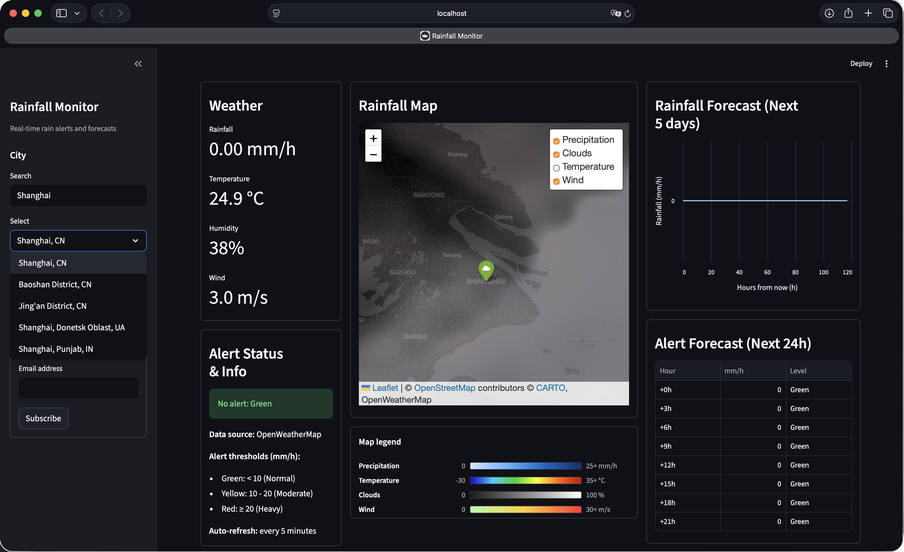

# Rainfall Monitor

> Experiment 1 of the [Smart Water Lab coursework](../README.md). The top-level README compares all four experiments and marks what the brief required versus the extra work I added.



A Python tool that monitors rainfall for a city using the [OpenWeatherMap](https://openweathermap.org) free-tier API. It lives in one file, `weather_monitor.py`, and runs as either a CLI or a Streamlit dashboard.

---

## What it does

- Fetches the current rainfall rate (mm/h) for a city you choose.
- Classifies the value against a fixed three-level scale:
  - **Green** for rainfall `< 10 mm/h` (normal),
  - **Yellow** for `10-20 mm/h` (moderate),
  - **Red** for `>= 20 mm/h` (heavy, alert).
- On a **Red** event, prints a warning and appends a timestamped line to `alert_log.txt`. Optionally also sends a notification email.
- Builds a 5-day rainfall forecast from the OpenWeatherMap forecast endpoint and applies a moving-average + exponential-smoothing pipeline to flag whether heavy rainfall is expected in the next 24 hours.
- In dashboard mode, shows a Folium map with four selectable OWM tile overlays (Precipitation, Clouds, Temperature, Wind) and an interpolated HeatMap of rainfall in cities near the selected one. Also lets users subscribe an email address to alerts (stored locally in `subscriptions.json`).

---

## Requirements

- **Python 3.10 or newer** (uses `str | None` syntax).
- **An OpenWeatherMap API key** (free tier is enough). Create one at <https://home.openweathermap.org/api_keys> and note that new keys take roughly 10 minutes to a few hours to activate before they work against the API.
- **Optional:** SMTP credentials if you want the email-alert feature. A Gmail account with an [App Password](https://myaccount.google.com/security) works out of the box.

### Python packages

| Package | Used by | Notes |
|---|---|---|
| `requests` | CLI + dashboard | core HTTP client |
| `streamlit` | dashboard only | requires version 1.30+ |
| `folium` | dashboard only | map rendering |
| `pandas` | dashboard only | forecast dataframe |
| `streamlit-folium` | dashboard only | embeds Folium in Streamlit |
| `streamlit-autorefresh` | dashboard only | 5-minute auto-refresh |
| `altair` | dashboard only | forecast chart (bundled with Streamlit) |

Install everything in one go:

```bash
pip install -r requirements.txt
```

The CLI needs only `requests` and imports nothing dashboard-related at startup, so installing the full set does no harm.

`requirements.txt` already includes `pytest` for the test suite. To install it on its own:

```bash
pip install pytest
```

---

## Setup

### 1. Set your OpenWeatherMap key

In the terminal you will use to run the program:

```bash
export OWM_API_KEY="<your-32-character-key>"
```

To check it is set without leaking the value:

```bash
echo "${OWM_API_KEY:+set}${OWM_API_KEY:-UNSET}"
```

You should see `set`. The same terminal will need this variable each time, so re-export it if you open a new tab.

### 2. (Optional) Set SMTP credentials for email alerts

Only needed if you plan to use `--email`:

```bash
export SMTP_HOST="smtp.gmail.com"
export SMTP_USER="<your-sender-address>"
export SMTP_PASSWORD="<your-app-password>"
# SMTP_PORT defaults to 587 (STARTTLS); only override if your provider differs.
```

For Gmail you must enable 2-Step Verification and generate an *App Password*, then use that string as `SMTP_PASSWORD` (not your normal account password).

---

## Usage

### CLI mode

```bash
python weather_monitor.py
```

Type a city name when prompted. The program fetches the current weather, classifies it, prints the result, and on a Red event logs it to `alert_log.txt`.

#### Flags

| Flag | Purpose |
|---|---|
| `--simulate <mm>` | Skip the API and feed a synthetic rainfall value (mm/h) into the pipeline. Useful to exercise the Yellow / Red branches without waiting for real heavy rain. |
| `--predict` | After the current-weather step, fetch the 5-day forecast and print a smoothed 24-hour summary (next-3h rate, 24h total, imminent alert flag). |
| `--email <addr>` | If the run produces a Red alert, also send a notification email to this address. Requires the SMTP environment variables to be set. |

You can combine the flags freely. A few useful examples:

```bash
# Just check the current weather for a city
python weather_monitor.py

# Force a Red alert to test the alert path without real rain
echo "Milan" | python weather_monitor.py --simulate 25

# Force a Red alert and email yourself the notification
echo "Milan" | python weather_monitor.py --simulate 25 --email you@example.com

# Get the 24-hour prediction for a city
echo "Rome" | python weather_monitor.py --predict
```

### Dashboard mode

```bash
streamlit run weather_monitor.py
```

A browser tab opens at <http://localhost:8501>. The page holds:

- A **sidebar** with the city search (free-text input that calls the OWM Geocoding API, then a select-box of candidate matches) and an email subscription form.
- **Column 1** with current rainfall, temperature, humidity and wind metrics plus a colour-coded alert badge.
- **Column 2** with the Folium map, four togglable OWM weather layers (Precipitation visible by default), a real HeatMap from nearby cities, and a colour legend underneath.
- **Column 3** with the smoothed 5-day forecast chart and a 24-hour alert-forecast table.

The page auto-refreshes every 5 minutes.

---

## Files produced

| File | When | Format |
|---|---|---|
| `alert_log.txt` | Appended every time a Red alert is triggered (real or simulated). | One line per event: `<ISO 8601 UTC timestamp> \| <city> \| <mm/h>`. Simulated entries get an extra `\| SIMULATED` suffix. |
| `subscriptions.json` | Created/updated when someone submits the dashboard subscription form. | A JSON list of `{email, city, country, subscribed_at}` records. |
| `.streamlit/config.toml` | Provided in the repository. Sets the Streamlit dark theme for the dashboard. | TOML. |

To clear test data between runs:

```bash
rm -f alert_log.txt subscriptions.json
```

---

## Tests

A small pytest suite lives in `tests/test_pure_functions.py`. It pins the contract of the deterministic parts of the application (classification thresholds, smoothing recipes, rain extraction, email body) plus a couple of side-effectful helpers (`log_red_alert` line format with ISO 8601 UTC timestamp; `save_subscription` JSON round-trip).

Run the whole suite from the project root:

```bash
pytest tests/
```

Or with verbose output and per-test names:

```bash
pytest tests/ -v
```

Notable cases included:

- 8 boundary values for `classify_rainfall` (`0`, `5`, `9.99`, `10`, `15`, `19.99`, `20`, `25` mm/h).
- Edge cases for `moving_average` and `exponential_smoothing` (constant series, empty input, alpha = 0/1).
- 5 shapes for `_rain_amount`, including the `"rain": null` case that crashed the dashboard in Iteration 5. This test guards against a repeat.
- `log_red_alert` is checked to produce a parseable ISO 8601 timestamp with zero UTC offset and a `| SIMULATED` suffix on simulated entries.

The suite uses pytest's `tmp_path` and `monkeypatch` fixtures, so it never writes to the real `alert_log.txt` or `subscriptions.json`.

---

## Project structure

```
rainfall_alert/
├── weather_monitor.py          # the whole application (CLI + dashboard)
├── requirements.txt            # pinned dependencies for this project
├── CLAUDE.md                   # behavioural rules + domain spec used during development
├── prompt_log.md               # iteration-by-iteration interaction log with the AI agent
├── alert_log.txt               # created on first Red alert
├── subscriptions.json          # created on first dashboard subscription
├── README.md                   # this file
├── screenshots/                # dashboard screenshots used in this README
│   ├── interface.png
│   ├── welcome_page.png
│   ├── dashboard_page.png
│   ├── city_selection_bar.png
│   └── errors_managements.png
├── .streamlit/
│   └── config.toml             # dark theme for the dashboard
└── tests/
    └── test_pure_functions.py  # pytest suite
```

Inside `weather_monitor.py`, `# === ... ===` banners mark each section: Constants, OWM Client, Classification & Prediction, Alerting, Subscriptions, CLI Entry Point, Streamlit Dashboard, Entry-Point Dispatch.

---

## Rate limits and known limits

- The OpenWeatherMap free tier is capped at **60 calls per minute**. The dashboard makes 4 calls per refresh (geocode + weather + forecast + nearby cities) and refreshes every 5 minutes, which is well under the cap for single-user use.
- The free tier has **no historical data endpoint**. The "Rainfall (forecast, next 5 days)" chart in the dashboard uses the smoothed forecast as the closest available time series.
- The dashboard stores subscriptions but does not send to them yet. Only the CLI `--email` flag sends mail, and only for the current run. `subscriptions.json` is a capture point for a future cron-style sender.

---

## Troubleshooting

- **`OWM_API_KEY environment variable is not set.`** Re-export the key in the terminal you are running from. Each terminal tab has its own environment.
- **`Invalid API key (HTTP 401).`** The key has not activated yet (wait ~10 minutes), or you exported it in a different shell from the one running the program. Verify with `echo "${#OWM_API_KEY}"`, which should print `32`.
- **Streamlit page loads but stays blank with a spinner.** One of the dashboard-only packages is missing. Run `pip install folium streamlit-folium streamlit-autorefresh` again.
- **`SMTP error ... (535, ... Username and Password not accepted ...)`** Gmail wants an App Password here, not your regular account password.

---

## Credits

- Weather data: [OpenWeatherMap](https://openweathermap.org).
- Map tiles: OpenWeatherMap weather layers + [CartoDB Dark Matter](https://carto.com/) base.
- Built as part of a Software Development course experiment (see `CLAUDE.md` and `prompt_log.md` for the design constraints and iteration history).
