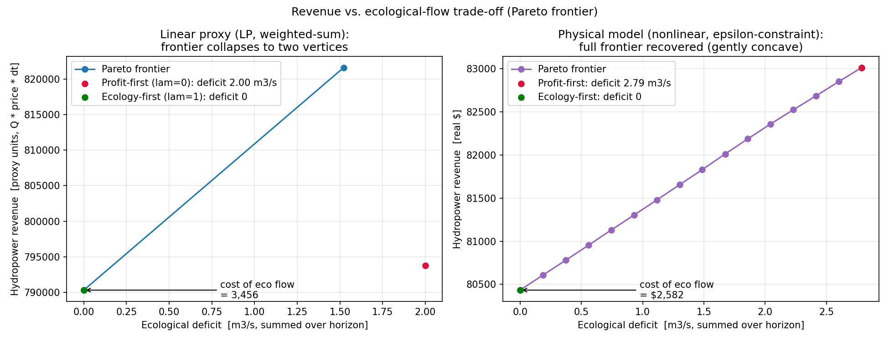

# Reservoir Dispatch Optimization

> Experiment 3 of the [Smart Water Lab coursework](../README.md). The top-level README compares all four experiments and marks what the brief required versus the extra work I added.



A Python model that optimises water releases from a reservoir over a 7-day drought, balancing hydropower revenue against downstream ecological flow. It lives in one file, `reservoir_optimize.py`, built on SciPy's optimisers. Run it as a script to solve the problem and write the deliverables, or import its functions for reuse.

---

## What it does

- Solves the core dispatch as a linear program with `scipy.optimize.linprog` (HiGHS): maximise revenue `sum(Q * price * dt)` subject to release bounds, storage bounds, and the daily mass balance. The optimum banks cheap inflow early and releases on the high-price day for 790,304 proxy units.
- Re-solves the same problem with SLSQP and L-BFGS-B (`scipy.optimize.minimize`) in parallel and scores both against the LP. SLSQP reproduces the optimum to within solver tolerance; L-BFGS-B stays feasible but, with the storage bounds folded into a penalty, trails by about 6%.
- Traces the revenue-vs-ecology trade-off two ways: a weighted-sum sweep on the linear proxy (which collapses to the two frontier vertices) and an epsilon-constraint frontier on the physical model (a full, gently concave curve). The cost of holding the ecological minimum is 3,456 proxy units, 0.44% of unconstrained revenue. Saved to `tradeoff_analysis.png`.
- Validates the chosen schedule against five checks (storage bounds, ecological minimum, release cap, mass balance, revenue) and writes `optimal_schedule.csv` and `validation_report.txt`.
- Adds three operational studies, each with its own plot: rolling-horizon dispatch (optimal from a 2-day lookahead, infeasible with one), inflow-forecast uncertainty (Monte Carlo fragility plus robust safety margins), and a water-quality dilution floor (revenue cost 3.41% at the headline 12 m³/s, infeasible past ~12.5 m³/s).

---

## The problem

Releases `Q_t` over a 7-day horizon are the only decision variables; end-of-day storage follows from them. With `dt = 86,400 s`:

```
maximise   sum_t  Q_t * price_t * dt           revenue (proxy units)
s.t.       Q_eco <= Q_t  <= Q_max              release bounds
           V_t = V_{t-1} + (I_t - Q_t) * dt    storage mass balance
           V_min <= V_t  <= V_max              storage bounds
```

Domain parameters (drought scenario):

| Quantity | Symbol | Value |
|---|---|---|
| Initial storage | V0 | 500,000 m³ |
| Storage bounds | V_min, V_max | 100,000 / 1,000,000 m³ |
| Ecological release | Q_eco | 10 m³/s |
| Maximum release | Q_max | 100 m³/s |
| Inflow forecast | I_t | [15, 12, 10, 8, 12, 15, 18] m³/s |
| Hydropower price | p_t | [0.08, 0.08, 0.08, 0.08, 0.10, 0.12, 0.10] $/kWh |
| Horizon | T | 7 days |

Substituting the mass balance into the storage bounds turns them into linear inequalities `A_ub @ Q <= b_ub` (2T rows, built by `storage_bounds()`), so the core problem is a pure LP. The full derivation, including the multi-objective relaxation, is in [`extras/formulation.md`](extras/formulation.md).

---

## Requirements

- **Python 3.10 or newer** (the stack the project targets; recent SciPy and NumPy build against 3.10+).
- **NumPy, SciPy, and Matplotlib.** All three are needed even to import the module, since it pulls in Matplotlib at the top.

| Package | Used by | Notes |
|---|---|---|
| `numpy` | model + plots | arrays, Monte Carlo inflow scenarios |
| `scipy` | model | `linprog` (HiGHS), `minimize` (SLSQP, L-BFGS-B) |
| `matplotlib` | plots | the four PNG figures, forced to the headless `Agg` backend |

Install the three packages:

```bash
pip install numpy scipy matplotlib
```

The script needs no display: it sets Matplotlib's `Agg` backend in code and writes the figures straight to disk. For the test suite, also install `pytest`.

---

## Usage

### Running the analysis

```bash
python reservoir_optimize.py
```

This prints the reference optimum, the solver-comparison table, the trade-off summary, the 5/5 validation result, and the rolling-horizon, uncertainty, water-quality, and physical-model sections, then writes six files to the working directory (see [Files produced](#files-produced)).

### As a library

The pipeline is guarded behind `main()`, so importing the module loads the parameters and functions without printing anything or writing files:

```python
import reservoir_optimize as ro

ro.revenue(ro.X0)        # revenue of a candidate schedule (proxy units)
ro.rolling_horizon(2)    # (realised revenue, fail_day) for a 2-day lookahead
ro.wq_solve(12.0)        # (schedule, revenue) under a 12 m³/s dilution floor
```

The functions worth reaching for:

| Function | Returns | Purpose |
|---|---|---|
| `storage(Q)` | trajectory [m³] | end-of-day storage from a release schedule |
| `revenue(Q)` | proxy revenue | `sum(Q * price * dt)`, the LP objective |
| `solve_slsqp()`, `solve_lbfgsb()` | (name, Q, seconds) | the two `minimize` solvers compared to the LP |
| `solve_weighted(lam, rev_scale, def_scale)` | schedule | one weighted-sum trade-off point, `lam` in [0, 1] |
| `rolling_horizon(H)` | (revenue, fail_day) | receding-horizon dispatch with an H-day lookahead |
| `robust_solve(margin)` | (schedule, revenue) | revenue LP with the storage bounds tightened by `margin` |
| `wq_solve(q_wq)` | (schedule, revenue) | revenue LP with the release floor raised to max(Q_eco, q_wq) |

---

## Files produced

| File | When | Format |
|---|---|---|
| `optimal_schedule.csv` | Every run. | CSV: day, inflow, price, release, end-of-day storage, per-day revenue. |
| `validation_report.txt` | Every run. | Text: the 7-day schedule plus five constraint checks, each PASS/FAIL. |
| `tradeoff_analysis.png` | Every run. | PNG: two-panel Pareto frontier (linear proxy on the left, physical model on the right). |
| `additional_plots/rolling_horizon.png` | Every run. | PNG: realised revenue against the lookahead window, infeasible windows marked. |
| `additional_plots/uncertainty_analysis.png` | Every run. | PNG: violation probability and revenue against the storage safety margin. |
| `additional_plots/water_quality_analysis.png` | Every run. | PNG: revenue against the required dilution flow, infeasible region marked. |

The run writes `optimal_schedule.csv`, `validation_report.txt`, and `tradeoff_analysis.png` to the working directory, and the three optional-extension plots straight into `additional_plots/` (created if missing). The five mandated deliverables (`reservoir_optimize.py`, `optimal_schedule.csv`, `tradeoff_analysis.png`, `validation_report.txt`, `prompt_log.md`) stay at the top level.

---

## Tests

`test/test_reservoir_optimize.py` holds a 22-test `pytest` suite over the model: the LP reference optimum and its storage trajectory, the SLSQP and L-BFGS-B contracts, the trade-off endpoints and monotonicity, the rolling-horizon feasibility threshold, the inflow-uncertainty fragility, the water-quality floor and its infeasibility, and the physical head-coupled model.

Run it from the project root:

```bash
python -m pytest test/
```

For per-test names:

```bash
python -m pytest test/ -v
```

Use the `python -m` form. The suite lives in `test/` and imports `reservoir_optimize` from the project root, so `python -m pytest` is what puts the root on the import path; a bare `pytest test/` raises `ModuleNotFoundError`. The tests write no files, because the module keeps its pipeline behind `main()`.

Notable cases:

- The reference optimum, `revenue ≈ 790,304` with day 6 at 25.417 m³/s, feasible and deficit-free.
- `test_rolling_single_day_infeasible_on_day_4`: a one-day lookahead drains the reservoir and fails on day 4, the only day whose inflow (8 m³/s) sits below Q_eco.
- `test_deterministic_optimum_is_fragile`: the LP optimum rides the storage bounds, so its violation probability under 20% inflow error tops 50% (97.2% in the run).
- `test_water_quality_infeasible_above_budget`: a 20 m³/s dilution floor cannot be met within the drought water budget.
- `test_physical_defers_drawdown_vs_linear_proxy`: the head-coupled optimum holds more water than the linear-proxy optimum and releases less on the big drawdown day.

---

## Project structure

```
reservoir_optimization/
├── reservoir_optimize.py              # the whole model: LP reference + extensions, one file
├── optimal_schedule.csv               # generated: 7-day optimal release schedule
├── tradeoff_analysis.png              # generated: Pareto frontier (deliverable)
├── validation_report.txt              # generated: 5/5 constraint checks
├── additional_plots/                  # the three optional-extension plots, written here by the script
│   ├── rolling_horizon.png            # generated: rolling-horizon plot
│   ├── uncertainty_analysis.png       # generated: inflow-uncertainty plot
│   └── water_quality_analysis.png     # generated: water-quality plot
├── extras/
│   └── formulation.md                 # the LP and its multi-objective extension, written out
├── test/
│   └── test_reservoir_optimize.py     # 22-test pytest suite
├── CLAUDE.md                          # behavioural rules + domain spec used during development
├── prompt_log.md                      # iteration-by-iteration interaction log with the AI agent
└── README.md                          # this file
```

Inside `reservoir_optimize.py`, the module docstring lists the eight stages `main()` runs, and `# === ... ===` banners mark each one.

---

## Scope and known limits

- Revenue is the brief's linear proxy `Q * price * dt`, not a dollar amount. That choice keeps the core problem a true LP, and the validation report states it rather than rescaling silently. A separate head-coupled model (`solve_physical`) computes the physically accurate energy `eta*rho*g*Q*H*dt` in real dollars for comparison, kept out of the LP.
- The optimum is degenerate: days 1 to 4 share the same 0.08 price, so the total revenue is unique but the day-by-day split across those days is not. The schedule in `optimal_schedule.csv` is one valid optimum.
- Weighted-sum scalarisation on the linear LP returns only the two frontier vertices. The epsilon-constraint method on the physical model recovers the full curve; both appear in `tradeoff_analysis.png`.
- No static safety margin reaches a 5% violation target under 20% inflow error. The accumulated storage uncertainty (order 1e5 m³) is comparable to the usable range, so feedback through the rolling horizon, not a fixed margin, is the real fix.
- The water-quality study uses a constant dilution floor. It turns infeasible at about 12.5 m³/s, where the floor draws the reservoir below V_min on the day-4 inflow trough (inflow 8 m³/s), well before the horizon-average budget would bind.

---

## Troubleshooting

- **`ModuleNotFoundError: No module named 'reservoir_optimize'` when running tests.** Run from the project root with `python -m pytest test/`, not `pytest test/`. The module sits in the root and the suite in `test/`, so the `-m` form is what puts the root on the import path.
- **`pip install` fails with `externally-managed-environment` (PEP 668).** A Homebrew or system Python blocks global installs. Use a virtual environment, install for your user with `pip install --user numpy scipy matplotlib`, or override with `pip install --break-system-packages numpy scipy matplotlib`.
- **No plot window appears.** None is meant to: the code forces Matplotlib's `Agg` backend and writes the PNGs to disk. Open them from the working directory.
- **`linprog` fails or HiGHS is unavailable.** Update SciPy with `pip install -U scipy`; the `highs` method needs a reasonably recent release.

---

## Credits

- Optimisation: SciPy `linprog` (HiGHS) for the LP, `minimize` (SLSQP, L-BFGS-B) for the solver comparison, weighted-sum and epsilon-constraint for the trade-off, and a seeded Monte Carlo for the robustness study.
- Built as part of a Software Development course experiment. See `CLAUDE.md` for the design constraints and `prompt_log.md` for the iteration history.
