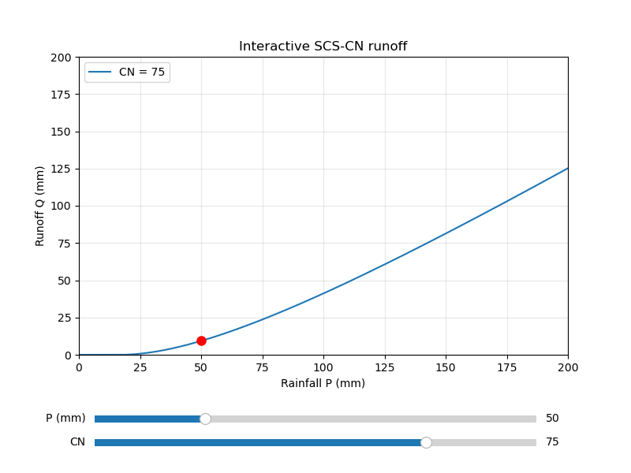

# SCS-CN Runoff Calculation

> Experiment 2 of the [Smart Water Lab coursework](../README.md). The top-level README compares all four experiments and marks what the brief required versus the extra work I added.



A Python implementation of the Soil Conservation Service Curve Number (SCS-CN) method for estimating direct runoff from rainfall. The core lives in one dependency-free module, `scscn_runoff.py`, with a companion `sensitivity_analysis.py` that turns the functions into plots.

---

## What it does

- Computes the SCS-CN direct runoff depth Q (mm) from a rainfall depth P and a curve number CN, with the physical boundaries built in: no runoff below the initial abstraction, Q never above P, and the CN = 0 and CN = 100 edges handled without a divide-by-zero.
- Adjusts the curve number for antecedent moisture using the Sobhani formulas: drier soil (AMC I), average soil (AMC II, the default passthrough), and wetter soil (AMC III).
- Routes excess rainfall into an outflow hydrograph (m³/s) with the time-area method. The routing respects the nonlinearity of SCS-CN by taking incremental excess as the first difference of cumulative runoff.
- Offers the Rational method as a second, independent estimate, returned as a depth so it lines up against SCS-CN on the same axis.
- Draws four Matplotlib figures and saves `runoff_comparison.png`: Q against P across several curve numbers, Q against CN at a fixed rainfall, SCS-CN against Rational, and an interactive plot with sliders for P and CN.

---

## The method

The runoff depth follows the standard SCS-CN equations:

```
S  = 25400 / CN - 254              potential maximum retention (mm)
Ia = 0.2 * S                       initial abstraction (mm)
Q  = (P - Ia)^2 / (P - Ia + S)     for P > Ia, otherwise Q = 0
```

The code clamps Q to Q <= P. Typical curve numbers by land cover:

| Surface | CN |
|---|---|
| Woods, good condition | 60-70 |
| Pasture, fair condition | 75-85 |
| Cultivated, straight row | 80-90 |
| Urban, residential | 75-90 |
| Paved areas | 95-100 |

---

## Requirements

- **Python 3.10 or newer** (the code uses `str | None` unions and `list[float]` generics).
- **NumPy and Matplotlib**, for `sensitivity_analysis.py` only.

The core module `scscn_runoff.py` and the test suite `test_scscn.py` import nothing outside the standard library, so you can use and test the runoff functions on a bare Python install.

| Package | Used by | Notes |
|---|---|---|
| `numpy` | `sensitivity_analysis.py` | samples the rainfall axis (`linspace`) |
| `matplotlib` | `sensitivity_analysis.py` | static plots and the interactive sliders |

Install the two plotting packages:

```bash
pip install numpy matplotlib
```

---

## Usage

### As a library

`scscn_runoff.py` exposes four functions. Import the ones you need:

```python
from scscn_runoff import (
    calculate_runoff,
    adjust_cn_for_amc,
    route_time_area,
    rational_runoff,
)

calculate_runoff(50, 80)        # 13.80 mm  (the experiment-guide reference case)
calculate_runoff(50, 80, "I")   # drier soil (AMC I): less runoff
rational_runoff(0.6, 20, 2)     # 24.0 mm   (C=0.6, i=20 mm/h, duration=2 h)
```

| Function | Returns | Purpose |
|---|---|---|
| `calculate_runoff(P, CN, amc="II")` | runoff depth Q (mm) | core SCS-CN equation with the four physical boundaries |
| `adjust_cn_for_amc(CN, amc)` | adjusted CN | Sobhani AMC I / III conversion; AMC II passes through unchanged |
| `route_time_area(rainfall, CN, time_area, area, dt)` | hydrograph (m³/s) | routes excess rainfall through a normalized time-area diagram |
| `rational_runoff(C, i, duration)` | runoff depth (mm) | Rational method, comparable to SCS-CN on depth |

### Generating the plots

```bash
python3 sensitivity_analysis.py
```

This writes `runoff_comparison.png` to the project root and opens four figure windows: the CN comparison, the Q-vs-CN sensitivity curve, the SCS-CN-vs-Rational comparison, and the interactive slider plot.

To produce the PNG on a machine with no display, force the headless backend:

```bash
MPLBACKEND=Agg python3 sensitivity_analysis.py
```

The interactive window needs a GUI backend, so skip headless mode when you want the sliders.

---

## Files produced

| File | When | Format |
|---|---|---|
| `runoff_comparison.png` | Written on every `sensitivity_analysis.py` run. | PNG: SCS-CN runoff against rainfall for six curve numbers. |

The other three figures open on screen but stay off disk unless you pass a `save_path` to their plot function. The snapshots under `additional_plots/` were saved that way during development.

---

## Tests

`test_scscn.py` holds a 27-test `unittest` suite over the four functions: the textbook reference value and the four physical boundaries for `calculate_runoff`, the error paths and the mass-conservation invariant for `route_time_area`, the Sobhani conversions and the backward-compatibility contract for the AMC adjustment, and the cross-method check that ties Rational to SCS-CN at the impervious limit.

Run it from the project root:

```bash
python3 -m unittest test_scscn
```

For per-test names:

```bash
python3 -m unittest test_scscn -v
```

The suite needs no third-party packages and writes no files.

Notable cases:

- The experiment-guide example `P = 50, CN = 80 -> Q ≈ 13.80 mm`, kept as its own test alongside the older `P = 100, CN = 75` reference value.
- The zero-rainfall impervious case `calculate_runoff(0, 100) == 0`, which raised `ZeroDivisionError` before the `P <= Ia` boundary fix.
- A grid sweep asserting `Q <= P` across a `[0, 200] x [0, 100]` range of `(P, CN)` pairs.
- Mass conservation for `route_time_area`: water in equals water out, both sides in cubic meters, including an un-normalized time-area diagram.

---

## Project structure

```
scs-cn_runoff_calculation/
├── scscn_runoff.py                 # core library: 4 runoff functions, standard library only
├── sensitivity_analysis.py         # Matplotlib plots + interactive sliders
├── test_scscn.py                   # 27-test unittest suite
├── runoff_comparison.png           # generated deliverable plot
├── additional_plots/               # snapshots of the other three figures
│   ├── sensitivity.png
│   ├── scs-cn_vs_rational_method.png
│   └── Interactive_plot.png
├── CLAUDE.md                       # behavioural rules + domain spec used during development
├── prompt_log.md                   # iteration-by-iteration interaction log with the AI agent
└── README.md                       # this file
```

Each function in `scscn_runoff.py` carries a NumPy-style docstring with its parameters, units, return value, and raised errors.

---

## Scope and known limits

- `calculate_runoff` trusts its inputs. It expects `P >= 0` and `CN` in `[0, 100]` and adds no guard for values outside that range, by design: the assignment asked for the formula, not a validation layer. The other three functions do validate and raise `ValueError` on bad input.
- The method comparison fixes the storm duration at 1 hour, which reduces the Rational depth to `C * P` and puts both methods on one rainfall axis. A different duration shifts the Rational line.
- The plots cover rainfall up to 200 mm and the curve numbers 60, 70, 80, 90, 95, 100. Edit the defaults in `sensitivity_analysis.py` to widen either range.

---

## Troubleshooting

- **`ModuleNotFoundError: No module named 'matplotlib'` (or `numpy`).** Install the two plotting packages: `pip install numpy matplotlib`. The core module and the tests run without them.
- **`pip install` fails with `externally-managed-environment` (PEP 668).** A Homebrew or system Python blocks global installs. Use a virtual environment, install for your user with `pip install --user numpy matplotlib`, or override with `pip install --break-system-packages numpy matplotlib`.
- **`python3 sensitivity_analysis.py` runs but no window appears.** The active Matplotlib backend is non-interactive. Unset `MPLBACKEND`, install a GUI backend, or read `runoff_comparison.png` from disk.
- **The interactive sliders stop responding.** The widgets stay alive while the figure is open; the function attaches them to `fig._sliders` for that reason. Keep the window open while dragging.

---

## Credits

- Method: USDA Soil Conservation Service Curve Number, with the Sobhani AMC conversions from the NRCS National Engineering Handbook (Part 630, Ch. 10) and Chow, Maidment & Mays.
- Built as part of a Software Development course experiment. See `CLAUDE.md` for the design constraints and `prompt_log.md` for the iteration history.
